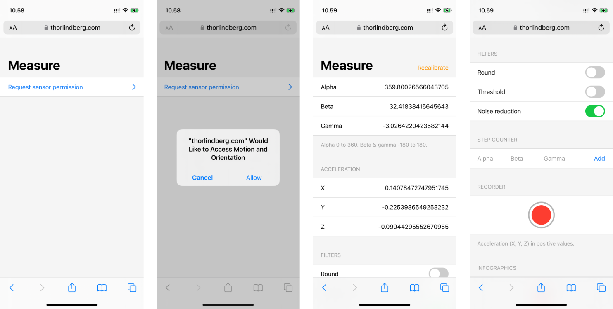
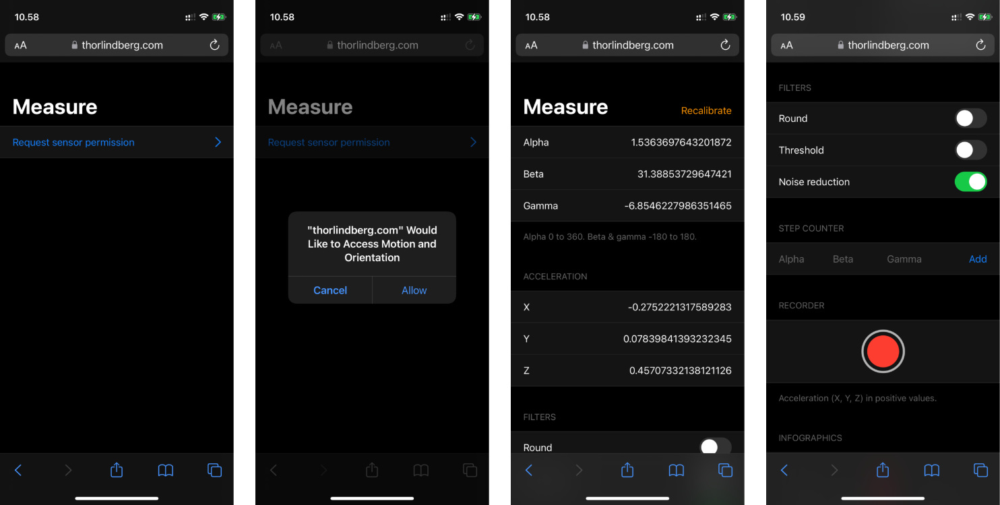

# Measure

## Demo

This link should be opened on a mobile device, as it uses mobile device sensors.

https://hejthor.github.io/measure/

## Description

Developing mobile applications that use sensors not found in laptops or desktops can be difficult. To aid in the development of mobile applications that depend on gyroscopes and accelerometers, this web application provides sensors readings and tools to measure these data.

The data describes orientation and acceleration of the device, which can be filtered for readability through toggles. The tools allow users to save steps or scores of sensor values, enabling measurements to be taken when looking at the device is not possible or practical. The recording function is intended for acceleration values, as acceleration is best represented as a scale between static and in-motion states.

 

**User interface**

Reading device sensors on mobile devices can require explicit consent from users, and as such this is the first step in the process. Once access has been given, a settings pane with live measurements is presented, which includes all the data and tools included in the application.

 

 

**Source code**

The structure, logic and styling of the web application.
